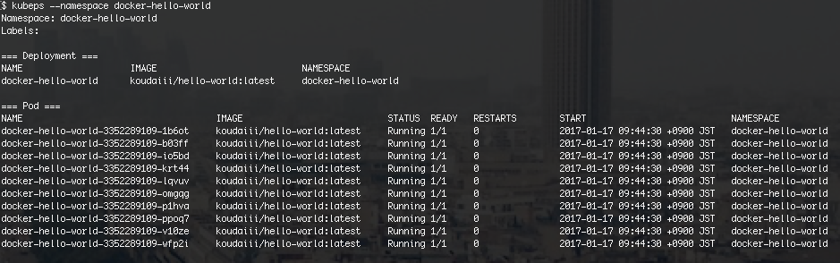

# kubeps

[](https://travis-ci.org/koudaiii/kubeps)
[](https://quay.io/repository/koudaiii/kubeps)
[](https://github.com/koudaiii/kubeps/releases)

Get container image tag for Kubernetes Pods

As you know, `kubectl get pod -o wide` can get only pod( NAME,READY,STATUS, RESTARTS,AGE,IP,NODE).
`kubectl get po` difficult for you to get container image or tag.
`kubeps` enables you to get container image and tag in ALL pods that the specified namespace or labels.



## Table of Contents

* [Requirements](#requirements)
* [Installation](#installation)
  + [Using Homebrew (OS X only)](#using-homebrew-os-x-only)
  + [Precompiled binary](#precompiled-binary)
  + [From source](#from-source)
  + [Run in a Docker container](#run-in-a-docker-container)
* [Usage](#usage)
  + [kubeconfig file](#kubeconfig-file)
  + [Options](#options)
* [Development](#development)
* [Author](#author)
* [License](#license)

## Requirements

Kubernetes 1.3 or above

## Installation

### Using Homebrew (OS X only)

Formula is available at [koudaiii/homebrew-koudaiii](https://github.com/koudaiii/homebrew-koudaiii).

```bash
$ brew tap koudaiii/koudaiii
$ brew install kubeps
```

### Precompiled binary

Precompiled binaries for Windows, OS X, Linux are available at [Releases](https://github.com/koudaiii/kubeps/releases).

### From source

```bash
$ go get -d github.com/koudaiii/kubeps
$ cd $GOPATH/src/github.com/koudaiii/kubeps
$ make deps
$ make install
```

### Run in a Docker container

docker image is available at [quay.io/koudaiii/kubeps](https://quay.io/repository/koudaiii/kubeps).

```bash
# -t is required to colorize logs
$ docker run \
    --rm \
    -t \
    -v $HOME/.kube/config:/.kube/config \
    quay.io/koudaiii/kubeps:latest \
      -kubeconfig=/.kube/config
```

## Usage

Logs of all pods, all containers in pod in the specified namespace are streaming. When new pod is added, logs of the pod also appears.
To stop streaming and exit, press `Ctrl-C`.

```bash
```

### kubeconfig file

`kubeps` uses `~/.kube/config` as default.
You can specify another path by `KUBECONFIG` environment variable or `--kubeconfig` option.
`--kubeconfig` option always overrides `KUBECONFIG` environment variable.

```bash
$ KUBECONFIG=/path/to/kubeconfig kubeps
# or
$ kubeps --kubeconfig=/path/to/kubeconfig
```

### Options

|Option|Description|Required|Default|
|---------|-----------|-------|-------|
|`--kubeconfig=KUBECONFIG`|Path of kubeconfig||`~/.kube/config`|
|`--labels=LABELS`|Label filter query (e.g. `app=APP,role=ROLE`)|||
|`--namespace=NAMESPACE`|Kubernetes namespace||`default`|
|`-h`, `-help`|Print command line usage|||
|`-v`, `-version`|Print version|||

## Development

Clone this repository and build using `make`.

```bash
$ go get -d github.com/koudaiii/kubeps
$ cd $GOPATH/src/github.com/koudaiii/kubeps
$ make
```

## Author

[@koudaiii](https://github.com/koudaiii)

## License

[](LICENSE)
